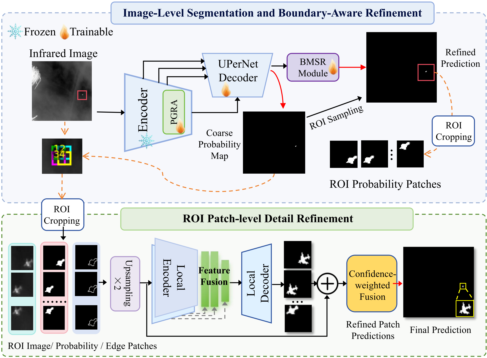
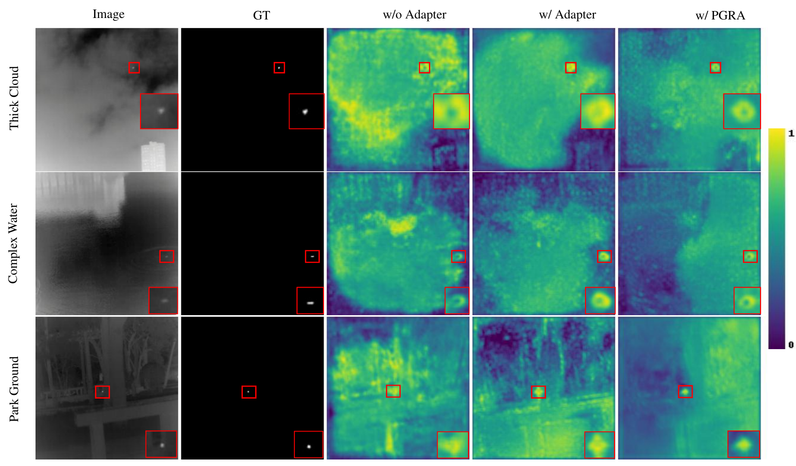

# PGSRNet

## Prior-Gated Adaptation with Multi-Granularity Structural Refinement for Infrared Small-Target Segmentation

PGSRNet is a parameter-efficient framework for fine-grained infrared small-target segmentation. It adapts a frozen InfMAE encoder using infrared-specific spatial priors and progressively refines the resulting segmentation at image and patch levels. The method is designed to preserve weak target responses, suppress structured background clutter, and improve the localization of small and ambiguous target regions.

This repository currently provides the standardized inference pipeline and the model components required for evaluation. The complete training code, final configurations, pretrained checkpoints, and full reproducibility materials will be released upon acceptance of the paper.

## Overview

Infrared small targets generally occupy only a few pixels and provide limited shape and texture information. Their sparse responses can be attenuated during hierarchical feature extraction, while isolated bright pixels, cloud edges, sea–sky boundaries, and other high-contrast structures may produce target-like activations. Although pretrained infrared foundation models provide transferable representations, full-parameter fine-tuning is computationally expensive, and generic parameter-efficient adapters do not explicitly constrain adaptation using infrared small-target characteristics.

PGSRNet addresses these issues with three components:

- **Prior-Gated Residual Adapter (PGRA):** introduces local contrast, edge structure, and background complexity as complementary spatial priors. These priors dynamically control where and to what extent lightweight residual updates are applied within the frozen InfMAE encoder, promoting target-relevant adaptation while reducing clutter-induced responses.
- **Boundary-Aware Multi-source Refinement (BMSR):** jointly exploits the coarse segmentation probability, image intensity, and edge cues to correct target contours and reduce adhesion to surrounding clutter.
- **Patch-level Local Detail Refinement (PLDR):** selects candidate target regions from the image-level prediction, performs local patch refinement, and projects the refined predictions back to the full-image space through distance-weighted probability fusion.

## Architecture

<p align="center">
  
</p>

<p align="center">
  <b>Figure 1.</b> Overall architecture of PGSRNet. The frozen InfMAE encoder is adapted by trainable PGRA modules for image-level segmentation, followed by BMSR for boundary-aware refinement. Candidate patches are selected from the coarse probability map according to salient target responses. The corresponding image, probability, and edge-guidance patches are processed by PLDR, and overlapping patch predictions are projected back to the full-image space through distance-weighted probability fusion.
</p>

## PGRA Feature Responses

<p align="center">
  
</p>

<p align="center">
  <b>Figure 2.</b> Fused feature responses under different adaptation settings in representative infrared small-target scenes. Compared with the model without adapters and the generic adapter variant, PGRA produces more target-concentrated responses while suppressing clutter-induced activations in thick-cloud, complex-water, and park-ground scenes. Red boxes indicate target regions and their corresponding enlarged views.
</p>

## Quantitative Results

The current manuscript reports the following results on two real-world infrared small-target datasets:

| Dataset | IoU (%) | F1-score (%) | Improvement over InfMAE-UPerNet (IoU/F1) |
|---|---:|---:|---:|
| IRSTD-1k | 71.38 | 83.30 | +5.68 / +4.00 |
| NUAA-SIRST | 75.78 | 86.22 | +10.03 / +6.88 |

PGSRNet contains approximately **22.51M trainable parameters**, providing a competitive balance between segmentation accuracy and parameter-efficient adaptation.

## Repository Structure

```text
PGSRNet/
├── assets/
│   ├── fig1.png
│   └── fig2.png
├── models/
│   ├── pgsrnet.py
│   ├── infMAE_uperhead.py
│   └── patch_unet.py
├── dataset.py
├── inference.py
└── README.md
```

The implementation of `models/infMAE_uperhead.py` should provide the following interfaces:

```python
MaskedAutoencoderInfMAE
load_infmae_pretrain
UPerHead
InfMAEBackbone
```

## Environment

The inference code requires Python, PyTorch, and the following packages:

```bash
pip install numpy opencv-python pillow scikit-image tqdm
```

Install a PyTorch version compatible with the local CUDA environment before running inference. The code also supports CPU inference, although GPU inference is recommended.

## Dataset Organization

The unified inference script supports **IRSTD-1k**, **NUAA-SIRST**, and **NUDT-SIRST**.

### IRSTD-1k

```text
IRSTD-1k/
├── IRSTD1k_Img/
├── IRSTD1k_Label/
└── test.txt
```

### NUAA-SIRST

```text
NUAA-SIRST/
├── images/
├── masks/
└── img_idx/
    └── test_NUAA-SIRST.txt
```

### NUDT-SIRST

```text
NUDT-SIRST/
├── images/
├── masks/
└── img_idx/
    └── test_NUDT-SIRST.txt
```

Each validation-list line may contain either a sample identifier or an image–mask path pair. Image extensions are resolved automatically when they are omitted.

## Trained Checkpoints

The pretrained PGSRNet checkpoints can be downloaded from Baidu Netdisk:


- **Download:** [Baidu Netdisk](https://pan.baidu.com/s/1nGgV00TcuA7sRLbw2SLqdA)
- **Extraction code:** `nm39`


After downloading, place the checkpoints in the `weights/` directory:


```text
PGSRNet/
└── weights/
    ├── irstd1k.pth
    ├── nuaa.pth
    └── nudt.pth
    
    
## Inference

Run inference by specifying the dataset and checkpoint:

```bash
python inference.py \
    --dataset nudt \
    --ckpt path/to/nudt_checkpoint.pth \
    --device cuda:0
```

Examples for the other datasets are:

```bash
python inference.py --dataset irstd1k --ckpt path/to/irstd1k_checkpoint.pth
python inference.py --dataset nuaa --ckpt path/to/nuaa_checkpoint.pth
```

To override the dataset paths configured in the script:

```bash
python inference.py \
    --dataset nuaa \
    --root path/to/NUAA-SIRST \
    --val-list path/to/NUAA-SIRST/img_idx/test_NUAA-SIRST.txt \
    --ckpt path/to/nuaa_checkpoint.pth
```

Mixed-precision inference can be enabled with:

```bash
python inference.py --dataset nuaa --ckpt path/to/checkpoint.pth --amp
```


### Main Arguments

| Argument | Description |
|---|---|
| `--dataset` | Dataset name: `irstd1k`, `nuaa`, or `nudt`. |
| `--root` | Optional dataset-root override. |
| `--val-list` | Optional validation-list override. An absolute path or a path relative to `--root` is accepted. |
| `--ckpt` | Path to the trained PGSRNet checkpoint. |
| `--pretrain-path` | Optional InfMAE pretrained checkpoint, required only when the supplied checkpoint contains adapter-only weights. |
| `--device` | Inference device, such as `cuda:0` or `cpu`. |
| `--amp` | Enable automatic mixed-precision inference on CUDA. |
| `--save-dir` | Directory used to save predictions, visualizations, and the evaluation summary. |

The model reconstructs the InfMAE encoder grid from the checkpoint and supports the native evaluation sizes used by the three datasets. A successfully matched checkpoint should report:

```text
[checkpoint] loaded=2880/2880, missing=0, unexpected=0, shape_mismatch=0
```

## Evaluation and Output

The inference script reports pixel-level and target-level metrics:

- intersection over union (**IoU**);
- normalized IoU (**nIoU**);
- precision, recall, and **F1-score**;
- probability of detection (**Pd**);
- false-alarm rate (**Fa**).

The following files are saved under the output directory:

```text
predict_results/
├── pred_bin/          # binary predictions
├── gt_bin/            # binary ground-truth masks
├── diff/              # false-positive/false-negative difference maps
├── panel/             # image, ground truth, prediction, and difference panels
└── infer_summary.txt  # quantitative evaluation summary
```

## Code Availability

The current release is intended to support method inspection and standardized inference. The complete source code, training scripts, pretrained model weights, dataset-specific configurations, and additional experimental materials will be made publicly available once the paper is accepted.

## Citation

Citation information will be added after acceptance and publication of the paper.

## Acknowledgements

PGSRNet builds upon the transferable infrared representations learned by **InfMAE** and uses **UPerNet** as the multi-level segmentation decoder. We thank the authors of the related open-source projects and infrared small-target datasets for supporting this research.
